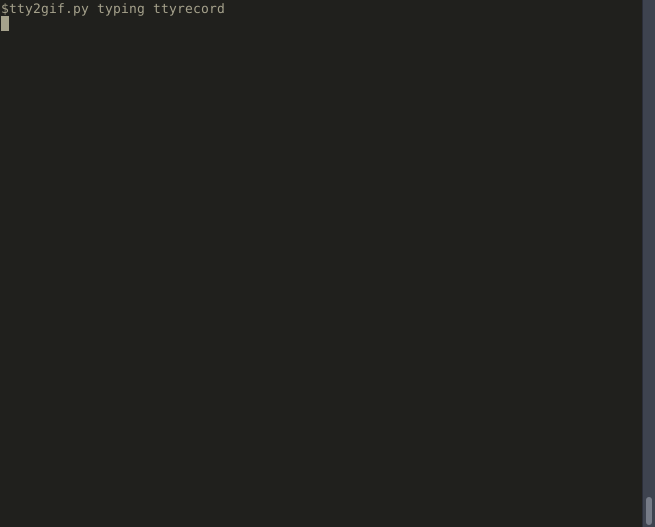

# Jumpdir

A minimal command line utility for quickly jumping to different directories within your home directory.




## Installation

Simply

```bash
pip install jumpdir
```

Then add the following to your .bashrc

```bash
function jd {
    TARGET="$(jumpdir search $@)"

    if [ $TARGET != "None" ]; then
        cd $TARGET
    else
        echo "Jumpdir could not find a matching directory :("
    fi
}
```

## Description

Jumpdir is case insensitive and searches through your bookmarks and home folder for a directory whose name matches the provided search term (note: jumpdir prioritises bookmarks). Jumpdir will look for directories whose names match your search term and will return the directory with the shortest path. 

The initial `jumpdir search ...` of a home directory can be slow, however your home folder will be cached under `~/.jumpdir/.jdcache.json`, improving lookup times drastically. If jumpdir cannot find a matching bookmark or cached directory, it will search through your actual home directory and update the cache file.

## Useage

Using the following example home directory:

```
.
|-- Devel/
|   |-- python/
|   |   '-- script.py
|   |-- django/
|       '-- somesite/
|           '-- nothinghere.jpg
|-- Downloads/
|   |-- eastclintwood.jpg
|   '-- yup.mp3
|-- Other/
    |-- Stuff
        '-- python/
            '-- duplicate testing
```

Using jumpdir with the jd function works as follows:

```shell
~ $ jd devel
~/Devel $ jd DOWNLOADS
~/Downloads $ jd django
~/Devel/django $ jd othe
Jumpdir could not find a matching directory :(
~/Devel/django $ jd python
~/Devel/python $ # jumpdir will choose the directory with the shortest path
```

To edit or view bookmarks use the jumpdir command:

```
~ $ jumpdir add bookmarkName -p ~/Devel/python
Bookmarked path '/home/chrsintyre/Devel/python' under 'bookmarkName'
~ $ jd bookmarkName
~/Devel/python $ jd downloads
~/Downloads $ jumpdir add bookmarkName # This will replace the first bookmark
Bookmarked path '/home/chrsintyre/Downloads' under 'bookmarkName'
~/Downloads $ jumpdir list
Jumpdir Bookmarks:
    bookmarkName : /home/chrsintyre/Downloads
~/Downloads $ jumpdir delete bookmarkName
Deleted bookmark 'bookmarkName
~/Downloads $ jumpdir list
No bookmarks saved
~/Downloads $
```
